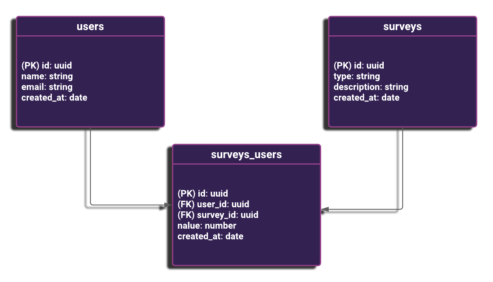
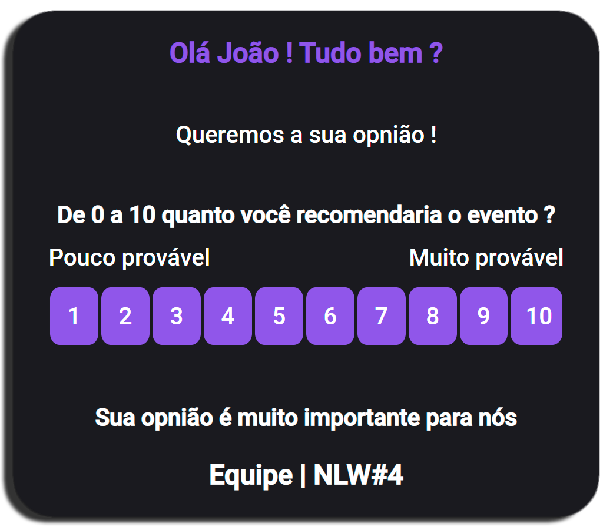

<h1 align="center">:+1: API - Net Promoter Score :chart:</h1>

<p align="center">
 <a href="https://www.linkedin.com/in/igor-gregori/">
    
  </a>
  <a href="https://github.com/Igor-Gregori/Net-Promoter-Score-NLW/blob/main/LICENSE">
    
  </a>
  <a href="https://github.com/Igor-Gregori/Net-Promoter-Score-NLW/issues">
    
  </a>
  <a href="https://github.com/Igor-Gregori/Net-Promoter-Score-NLW/issues?q=is%3Aissue+is%3Aclosed">
    
  </a>
  <a href="https://github.com/Igor-Gregori/Net-Promoter-Score-NLW/stargazers">
    
  </a>
  <a href="https://github.com/Igor-Gregori/Net-Promoter-Score-NLW/network">
    
  </a>
</p>

<p align="center">
  <a href="#page_facing_up-descrição">Descrição</a>&nbsp;&nbsp;&nbsp;|&nbsp;&nbsp;&nbsp;
  <a href="#-tecnologias">Tecnologias</a>&nbsp;&nbsp;&nbsp;|&nbsp;&nbsp;&nbsp;
  <a href="#-diagrama">Diagrama</a>&nbsp;&nbsp;&nbsp;|&nbsp;&nbsp;&nbsp;
  <a href="#computer-instalação">Instalação</a>&nbsp;&nbsp;&nbsp;|&nbsp;&nbsp;&nbsp;
  <a href="#man-Desenvolvedor">Desenvolvedor</a>&nbsp;&nbsp;&nbsp;|&nbsp;&nbsp;&nbsp;
  <a href="#-licença">Licença</a>
</p>

<p align="center">
      
</p>

## :page_facing_up: Descrição

NPS ou Net Promoter Score é uma métrica criada por Fred Reichheld para medir a satisfação dos clientes, perguntando “de 0 a 10, o quanto você indicaria nossa empresa aos amigos?” A fórmula para calcular o NPS é: % clientes promotores (notas 9 e 10) – % clientes detratores (notas de 0 a 6) = NPS

O API - Net Promoter Score é uma aplicação que consiste em calcular o NPS da empresa. Nele fazemos o cadastro de usuários, cadastro de pesquisas, envio de e-mail para os usuários responderem as pesquisas de satisfação e com isso podemos realizar o cálculo do NPS.

## ✨ Tecnologias

Esse projeto foi desenvolvido com as seguintes tecnologias:

- [TypeScript](https://www.typescriptlang.org/)
- [Ethereal-Email](https://ethereal.email/)
- [TypeORM](https://typeorm.io/#/)
- [Express](https://expressjs.com/pt-br/)
- [Jest](https://jestjs.io/)
- [SQL Editor Beekeeper Studio](https://www.beekeeperstudio.io/)
- Para mais detalhes, veja o <kbd>[package.json](./package.json)</kbd>

## 🔶 Diagrama



## :computer: Instalação

### Pré-requisitos

Antes de começar, você vai precisar ter instalado em sua máquina as seguintes ferramentas:
[Git](https://git-scm.com), [Node.js](https://nodejs.org/en/), Além disto é bom ter um editor para trabalhar com o código como [VSCode](https://code.visualstudio.com/)

```bash
# Clone este repositório.
$ git clone https://github.com/Igor-Gregori/Net-Promoter-Score-NLW

# Vá para a pasta moveit
$ cd Net-Promoter-Score-NLW

# Instale as dependências
$ yarn

# Execute aplicação
$ yarn dev

# O app vai está rodando na porta 3333
```
Agora através de algum client rest api como o [Insomnia](https://insomnia.rest/download) você poderá cadastrar clientes, cadastrar pesquisas, mandar emails como a imagem abaixo e calcular o NPS que sua empresa terá

<p align="center"> 
   
</p>

## :man: Desenvolvedor

<a href="https://github.com/Igor-Gregori">
 
 <br />
 <sub><b>Igor Gregori</b></sub>
</a>

Desenvolvido por <b>Igor Gregori</b> :metal::satisfied::+1: Entre em contato! :speech_balloon:

<a href="https://www.linkedin.com/in/igor-gregori/">
  
</a>

## :closed_book: Licença

This project is [MIT](https://github.com/Igor-Gregori/moveit/blob/main/LICENSE) licensed.

